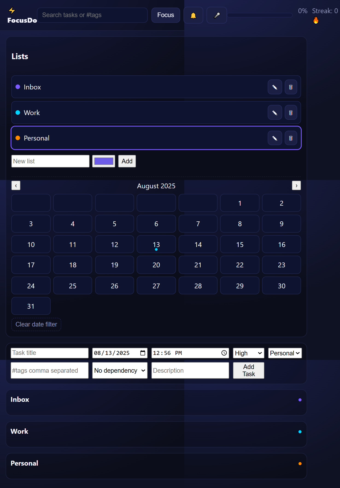

# 📝 FocusDo - Smart To-Do Web App

A modern, feature-rich **to-do list** web application designed for productivity competitions.  
Live Demo: **[FocusDo App](https://tejaswimadastu.github.io/SCT_WD_4/)**

---

## 🚀 Features
- ✅ Add, edit, and delete tasks
- 📅 Set due date & time for each task
- 📂 Organize tasks into custom lists
- 🏷️ Tag and search tasks
- 🎯 Focus mode to hide distractions
- 📊 Task completion statistics
- 📌 Drag-and-drop reordering
- 🔔 Browser notifications for reminders
- 🌙 Dark mode toggle

---

## 📂 Project Structure
SCT_WD_4/
│── index.html # Main HTML
│── style.css # App styling
│── app.js # Core JavaScript logic
│── icons/ # App icons

---

## 🛠️ Tech Stack
- **Frontend:** HTML, CSS, JavaScript
- **APIs:** Notifications API, LocalStorage
- **Design:** Responsive layout, CSS animations

---

## 📦 Installation & Local Run
1. Clone the repo:
   ```bash
   git clone https://github.com/Tejaswimadastu/SCT_WD_4.git
Open index.html in your browser
(No server required for basic usage)

🌐 Deployment
This app is deployed on GitHub Pages.
To deploy your own:

Go to repo → Settings → Pages

Branch: main → folder: / (root) → Save

Your app will be live in seconds.

📸 Screenshots

🏆 Competition Notes
Designed with a clean, modern UI

Extra features like focus mode, reminders, and drag-and-drop give it a competitive edge

Fully responsive for mobile and desktop

yaml
Copy
Edit


